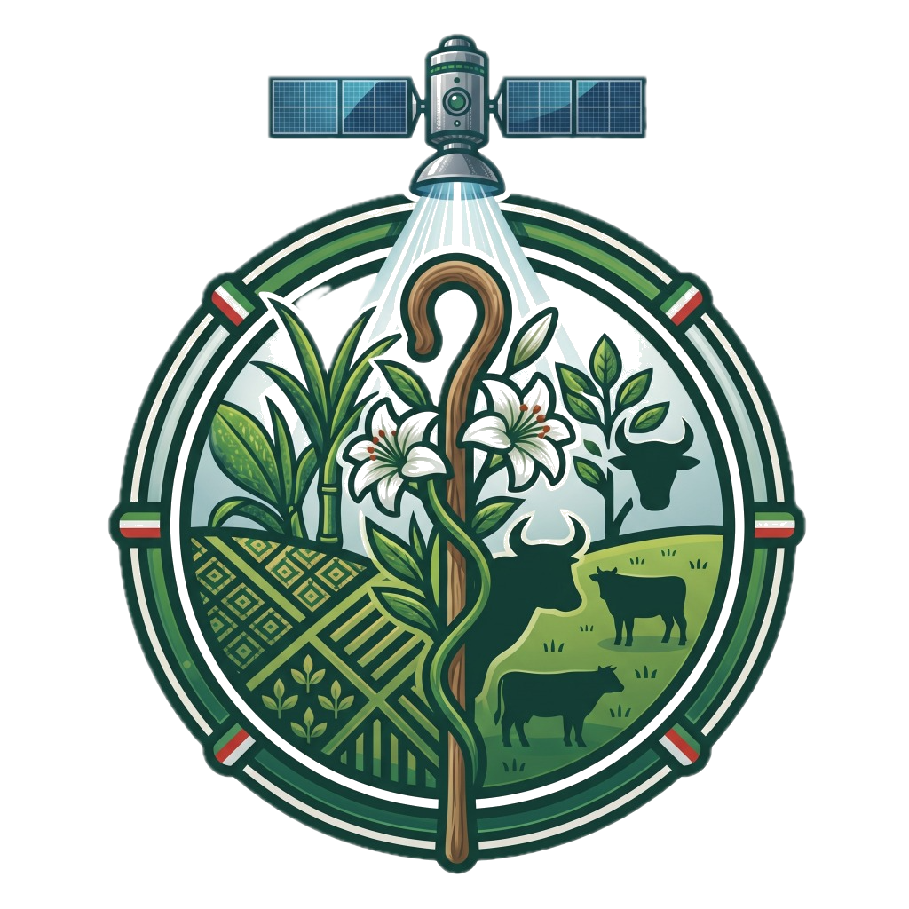

# OmniCrop AI — O Satélite Virtual do Agronegócio

<p align="center">
  
</p>

<p align="center">
  <a href="https://omnicropai.streamlit.app"><strong>🚀 Acesse o App em Produção →</strong></a>
</p>

<p align="center">
  
  
  
  
</p>

---

## O que é o OmniCrop AI?

O **OmniCrop AI** é um **Sistema de Suporte à Decisão (DSS)** end-to-end para o agronegócio. Ele atua como um **Satélite Virtual** — combinando dados climáticos em tempo real com um modelo de Machine Learning (XGBoost) para prever o vigor vegetativo (NDVI) de lavouras, mesmo em dias completamente nublados, quando satélites ópticos convencionais ficam cegos.

Desenhado do zero para ser comercializado no modelo **SaaS B2B Multi-Tenant**, com autenticação segura via JWT, isolamento de dados por Row Level Security (RLS) e suporte à gestão de múltiplas fazendas por usuário.

---

## O Problema que Resolvemos

Satélites ópticos (ex: Sentinel-2) têm janela de revisita de até **16 dias** e **não enxergam através das nuvens**. Justamente no verão tropical — época de máximo crescimento da cana — o céu está sempre coberto. O produtor fica cego durante os meses mais críticos da safra.

**A Solução:** Um modelo de ML que *prevê* o NDVI atual com base nos últimos 90 dias de dados climáticos (temperatura, radiação, chuva acumulada, Graus-Dia), garantindo **100% de visibilidade, 365 dias por ano**, sem depender de janela de satélite.

---

## Casos de Uso (Use Cases)

### UC-01 · Cadastro e Mapeamento de Fazenda
**Ator:** Produtor Rural / Agrônomo
**Fluxo:**
1. Usuário cria conta no sistema (e-mail + senha via Supabase Auth)
2. Busca a cidade/município pelo nome **ou** insere coordenadas manuais
3. Clica no mapa de satélite (Esri) para fixar o ponto exato da lavoura
4. Informa nome do talhão, área (ha) e **seleciona a cultura principal** (Cana-de-Açúcar, Soja, Café, Pecuária)
5. Sistema salva no Supabase com `user_id` atrelado, aplicando RLS automaticamente

---

### UC-02 · Monitoramento Diário do Talhão (Dashboard)
**Ator:** Produtor / Agrônomo / Gestor
**Fluxo:**
1. Usuário seleciona a fazenda ativa no dropdown da sidebar
2. Sistema busca 90 dias de histórico climático real na **API Open-Meteo**
3. Modelo XGBoost infere o NDVI atual e classifica o status de vigor
4. Dashboard exibe: KPIs climáticos, Gauge de NDVI, Alertas DSS e Checklist de ações

**Resultado esperado:** Em menos de 10 segundos, o agrônomo sabe se a lavoura está Saudável, Em Estresse ou Pronta para Colheita, com um plano de ação concreto.

---

### UC-03 · Roteamento Multi-Cultura
**Ator:** Produtor com fazendas de diferentes culturas
**Fluxo:**
1. Usuário seleciona uma fazenda de **Soja, Café ou Pecuária (Pasto)**
2. Sistema detecta `tipo_cultura` pertence ao grupo em treinamento
3. Redireciona para uma **página isolada e dedicada** — sem sidebar, sem PDF, sem ferramentas de cana
4. Página exibe: ícone da cultura, aviso "Módulo em Treinamento — v2.0", seletor de troca de fazenda e botão de logout

**Resultado esperado:** Experiência limpa sem ferramentas irrelevantes. O usuário entende que o módulo chegará na v2.0 e pode trocar para uma fazenda de Cana com um clique.

---

### UC-04 · Simulador de Intervenções (What-If)
**Ator:** Agrônomo / Consultor Técnico
**Fluxo:**
1. Acessa a aba **Simulador** no menu lateral
2. Configura um cenário hipotético: volume de irrigação (mm), dose de fertilizante, interrupção de chuvas
3. Sistema recalcula a projeção do NDVI e exibe o ROI energético do pivô de irrigação
4. Agrônomo decide se a intervenção é economicamente justificada

---

### UC-05 · Análise de Risco Hídrico e Colheita
**Ator:** Gestor de Operações
**Fluxo:**
1. Acessa a aba **Análise** no menu lateral
2. Sistema exibe: previsão dos próximos 15 dias, janela ideal de colheita (3 dias consecutivos < 2mm de chuva), déficit hídrico (GDA) e curva de Balança Hídrica
3. Gestor agenda a frente de colheita mecanizada na janela identificada pelo algoritmo

---

### UC-06 · Relatório Executivo (PDF)
**Ator:** Gerente Agrícola / Diretor de Operações
**Fluxo:**
1. No Dashboard, clica em **"Gerar Relatório Executivo (PDF)"**
2. Sistema chama a API Gemini para gerar um resumo agronômico
3. Compila: cabeçalho corporativo, tabela de KPIs, alertas DSS e resumo de IA
4. Disponibiliza o PDF para download imediato (sem recarregar a página via `@st.fragment`)

---

### UC-07 · Gestão da Fazenda (Renomear / Editar / Deletar)
**Ator:** Produtor
**Fluxo:**
1. Acessa **Minha Fazenda** no menu lateral
2. Edita nome, cidade, área, variedade da fazenda selecionada
3. Salva as alterações (Supabase `update`) ou deleta o talhão permanentemente

---

### UC-08 · Assistente de Manejo (Chat IA)
**Ator:** Produtor / Agrônomo
**Fluxo:**
1. Acessa **Assistente de Manejo** no menu lateral
2. Faz perguntas em linguagem natural: "Posso aplicar maturador agora?" / "Qual o risco de praga?"
3. IA responde com base no contexto agrícola embarcado no sistema (Gemini + RAG)

---

### UC-09 · Alertas Automáticos por E-mail (CRON)
**Ator:** Sistema (automático, madrugada)
**Fluxo:**
1. Cronjob (`scripts/daily_alerts.py`) varre todas as fazendas cadastradas
2. Para cada fazenda com risco crítico (déficit hídrico, NDVI abaixo do threshold), dispara e-mail de alerta
3. Usuário recebe o alerta antes de começar o dia no campo

---

## Arquitetura do Sistema

```
┌──────────────────────────────────────────────────────────┐
│                   CAMADA DE APRESENTAÇÃO                 │
│                                                          │
│  app.py (Painel Geral)    pages/                         │
│  ┌─────────────────────┐  ├── 2_Simulador.py             │
│  │ render_auth_page()  │  ├── 3_Analise.py               │
│  │ render_onboarding() │  ├── 4_Minha_Fazenda.py         │
│  │ render_farm_        │  ├── 5_Configuracoes.py         │
│  │   selector()        │  └── 6_Assistente_de_Manejo.py  │
│  │ render_cultura_em_  │                                  │
│  │   treinamento()     │                                  │
│  │ render_main_app()   │                                  │
│  └─────────────────────┘                                  │
└──────────────┬───────────────────────────────────────────┘
               │
┌──────────────▼───────────────────────────────────────────┐
│                   CAMADA DE COMPONENTES                  │
│                                                          │
│  auth.py         → Login / Registro / Cookies            │
│  db.py           → Ponte Zero-Trust Supabase (JWT)       │
│  farm_config.py  → CRUD de fazendas + session state      │
│  header.py       → Sidebar global + status do talhão     │
│  styles.py       → CSS global + fundo dinâmico           │
│  live_data.py    → Open-Meteo API + Geocoding            │
│  api_client.py   → Modelo XGBoost + DSS Agronômico       │
│  charts.py       → Gráficos Plotly                       │
│  pdf_generator.py→ Relatório PDF (fpdf2 + Gemini)        │
└──────────────┬───────────────────────────────────────────┘
               │
┌──────────────▼───────────────────────────────────────────┐
│                   CAMADA DE DADOS                        │
│                                                          │
│  Supabase (PostgreSQL + RLS)   APIs Externas             │
│  ├── tabela: fazendas          ├── Open-Meteo (Clima)    │
│  │   ├── user_id (RLS key)     ├── Nominatim (Geocoding) │
│  │   ├── lat / lon             └── Google Gemini (IA)    │
│  │   └── tipo_cultura                                    │
│  └── Auth GoTrue (JWT)         Modelo Local              │
│                                models/ndvi_xgb_model.pkl │
└──────────────────────────────────────────────────────────┘
               │
┌──────────────▼───────────────────────────────────────────┐
│                   CAMADA DE OPERAÇÕES                    │
│                                                          │
│  scripts/daily_alerts.py  → CRON noturno + alertas      │
│  assets/                  → logo.png, background.jpg,    │
│                               fundo_tech.jpg             │
│  .github/workflows/       → CI Pipeline                  │
└──────────────────────────────────────────────────────────┘
```

### Motor de Roteamento de Páginas

```
Requisição chegou
        │
        ├─ Usuário não autenticado?    → render_auth_page()
        │                                (Login + fundo drone)
        │
        ├─ Flag show_onboarding=True?  → render_onboarding()
        │                                (Mapa Folium interativo)
        │
        ├─ active_farm = None?         → render_farm_selector()
        │                                (Lista de fazendas)
        │
        ├─ tipo_cultura ∈              → render_cultura_em_treinamento()
        │  {Soja, Café, Pecuária}?      (Página isolada, sem sidebar)
        │
        └─ Cana-de-Açúcar (default)   → render_main_app()
                                         (Dashboard completo)
```

---

## Segurança — Defesa em Profundidade

| Camada | Mecanismo | Garantia |
|---|---|---|
| **Identity & Auth** | Supabase GoTrue (JWT) | Nenhum acesso é anônimo. Tokens de curta duração. |
| **Row Level Security** | PostgreSQL RLS Policies | O banco rejeita SQL cruzado entre `user_id` no nível do motor |
| **Ponte Zero-Trust** | `db.py` + header JWT | Cada query carrega o token do usuário logado, não um superadmin |
| **Cofre de Chaves** | `secrets.toml` / Env Vars | Credenciais nunca sobem ao repositório Git |
| **Cookies Seguros** | `streamlit_cookies_controller` | Sessão persistente com refresh token criptografado |

---

## Modelo de IA — XGBoost (Gradient Boosting)

Por que XGBoost e não Redes Neurais?

- **Relacionamentos Não-Lineares:** Mapeia quebras biológicas com precisão (waterlogging, estresse hídrico)
- **Performance Tabular:** Inferência em < 50ms por fazenda — essencial para SaaS multi-usuário
- **Explicabilidade:** Feature Importance exposta ao agrônomo ("Chuva 30d pesa 45% na decisão")

**Features de entrada:**

| Feature | Janela |
|---|---|
| Temperatura Média / Máx / Mín (°C) | Diária |
| Precipitação acumulada | 7d, 30d, 90d |
| Graus-Dia Acumulados (GDA) | 90d |
| Radiação Solar Média (W/m²) | 30d |
| Umidade do Solo Volumétrica | Diária |

---

## Stack Tecnológico

| Camada | Tecnologia |
|---|---|
| **Frontend / App** | Streamlit + Plotly + Folium |
| **IA Preditiva** | XGBoost (scikit-learn pipeline) |
| **IA Generativa** | Google Gemini (PDF + Chat) |
| **Banco de Dados** | Supabase (PostgreSQL + RLS) |
| **Auth** | Supabase GoTrue (JWT) |
| **Dados Climáticos** | Open-Meteo API (Real-time) |
| **Geocoding** | OpenStreetMap Nominatim |
| **PDF** | fpdf2 |
| **Deploy** | Streamlit Community Cloud |

---

## Estrutura do Projeto

```text
OmniCrop/
├── assets/
│   ├── logo.png                    # Logo oficial (PNG transparente)
│   ├── background.jpg              # Fundo do dashboard (plantação)
│   └── fundo_tech.jpg              # Fundo da tela de login (drone noturno)
│
├── components/
│   ├── auth.py                     # Tela de Login/Registro com logo centralizada
│   ├── api_client.py               # Modelo XGBoost + Motor DSS (Matriz de Fases)
│   ├── charts.py                   # Gráficos Plotly (Gauge, Barras, Linhas)
│   ├── db.py                       # Ponte Zero-Trust Supabase (JWT por requisição)
│   ├── farm_config.py              # CRUD de fazendas + sincronização session_state
│   ├── header.py                   # Sidebar global + logo + status do talhão
│   ├── live_data.py                # Open-Meteo API (90d histórico + 15d previsão)
│   ├── pdf_generator.py            # Gerador de PDF executivo (fpdf2 + Gemini)
│   └── styles.py                   # CSS global: fundo dinâmico login vs dashboard
│
├── pages/
│   ├── 2_Simulador.py              # Cenários What-If + ROI de irrigação
│   ├── 3_Analise.py                # Janela de Colheita + Balança Hídrica 15d
│   ├── 4_Minha_Fazenda.py          # CRUD de fazendas (renomear, editar, deletar)
│   ├── 5_Configuracoes.py          # Preferências do usuário + thresholds de alerta
│   └── 6_Assistente_de_Manejo.py  # Chat IA com RAG agronômico (Gemini)
│
├── scripts/
│   └── daily_alerts.py             # CRON: varredura noturna + e-mails de risco
│
├── models/
│   └── ndvi_xgb_model.pkl          # Modelo XGBoost treinado e exportado
│
├── app.py                          # Ponto de entrada + Motor de Roteamento
└── requirements.txt                # Dependências de produção
```

---

## Como Rodar Localmente

```bash
# 1. Clone o repositório
git clone https://github.com/PhSandoval/OmniCrop.AI.git
cd OmniCrop.AI

# 2. Crie e ative um ambiente virtual
python -m venv .venv
source .venv/bin/activate  # Windows: .venv\Scripts\activate

# 3. Instale as dependências
pip install -r requirements.txt

# 4. Configure as variáveis de ambiente
mkdir -p .streamlit
cat > .streamlit/secrets.toml << EOF
SUPABASE_URL = "sua-url-aqui"
SUPABASE_KEY = "sua-anon-key-aqui"
GEMINI_API_KEY = "sua-gemini-key-aqui"
EOF

# 5. Inicie o dashboard
streamlit run app.py
```

---

## Roadmap — OmniCrop AI v2.0

| Feature | Status |
|---|---|
| Módulo Cana-de-Açúcar (Dashboard, DSS, IA, PDF) | ✅ Produção |
| Multi-Tenant (múltiplas fazendas por usuário) | ✅ Produção |
| Relatório PDF Executivo com resumo Gemini | ✅ Produção |
| Roteamento Multi-Cultura com página de holding | ✅ Produção |
| Módulo Soja (modelo ML + DSS específico) | 🔄 Em Treinamento |
| Módulo Café (fenologia + gestão de colheita) | 🔄 Em Treinamento |
| Módulo Pecuária (taxa de lotação + pastejo) | 🔄 Em Treinamento |
| App Mobile (React Native / Flutter) | 📋 Planejado |
| Integração com satélites Sentinel-2 reais | 📋 Planejado |
